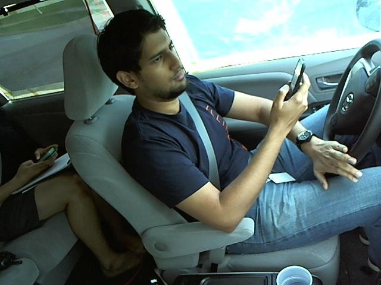
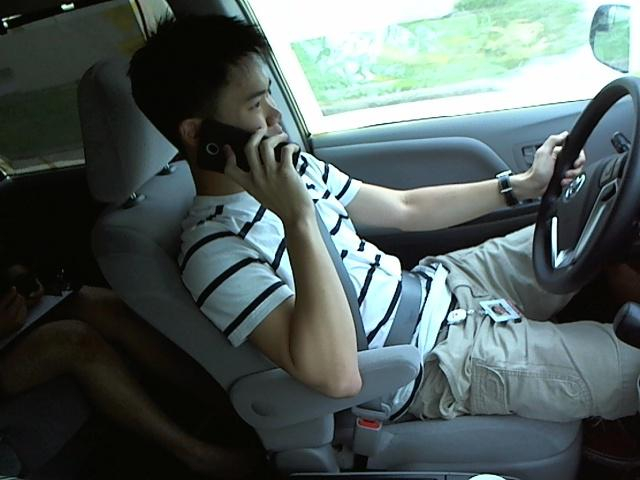
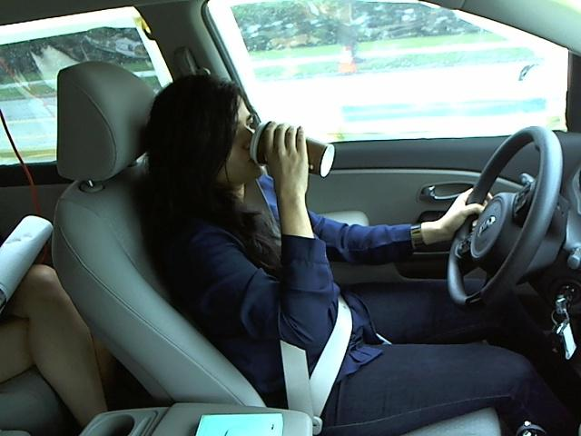
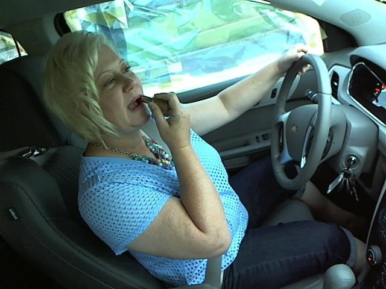

# Capstone Project - Distracted Driver Detection

## Contents

- [Problem Statement](#Problem-Statement)
- [Executive Summary](#Executive-Summary)
- [Notebook](#Notebook)
- [Conclusions and Recommendations](#Conclusions-and-Recommendations)
- [Further Exploration](#Further-Exploration)

## Problem Statement
According to a Road Traffic Injuries report by the [World Health Organisation](https://www.who.int/news-room/fact-sheets/detail/road-traffic-injuries), lives of approximately 1.35 million people around the world each year are cut short as a result of a road traffic crash. It is reported to be the leading cause of death for children and young adults aged 5-29 years.  

Between 20 and 50 million more people suffer non-fatal injuries, with many incurring a disability as a result of their injury. And it is this resultant disability that considerable economic costs is incurred by individuals, their family and the nation as whole. These losses arise from the cost of treatment as well as lost productivity for those killed or disabled by their injuries, and for family members who need to take time off work or school to care for the injured. Road traffic crashes cost most countries 3% of their gross domestic product.

So why are there so many road traffic crashes in the first place? 

One of the main leading cause is **Distracted Driving**. Distracted driving refers to the act of driving while engaging in other activities which diverts attention away from safe driving. Mobile phones are the main culprit of distracted driving. A study found that driving and talking on a mobile phone simultaneously quadruples the risk of crashing. The reaction time of a driver is slowed down by 38%, which is three times more than drinking and driving when surfing social media on your phone while driving. Other examples of distracted driving include:
* Operating the radio/GPS
* Drinking
* Doing hair and makeup
* Reaching behind
* Talking to passenger

In the United States alone, 25-50% of all auto vehicle crashes are directly related to driver distraction with nine percent of fatal crashes in 2016 were reported as distraction-affected crashes. In Singapore, 59 motorists died and 2,710 were injured during a one-year period as a result of drivers failing to keep a proper lookout on our roads.

In light of this, we will use dataset of 2D dashboard images of drivers from State Farm Insurance Company to build a multiclassifer model using Convultionary Neural Network(CNN) to detect and classify images of drivers as either safe driving, or any of the various examples of distracted driving such as texting or talking on the mobile phone. Our measure of success will be maximising the CNN accuracy and minimising the CNN loss.

    
     
    
     

We hope that this model will aide transport authorities around the world in keeping the roads safe by identifying and penalising these errant and reckless drivers, and hopefully deter drivers from being distracted on the road  

## Executive Summary

Our goal is to train a be able to train a Convultionary Neural Network(CNN) model to detect distracted drivers by classifying them accurately into the labels below:

* c0: safe driving
* c1: texting - right
* c2: talking on the phone - right
* c3: texting - left
* c4: talking on the phone - left
* c5: operating the radio
* c6: drinking
* c7: reaching behind
* c8: hair and makeup
* c9: talking to passenger

We leveraged on the 2D dashboard images that were taken from an controlled experiment conducted by State Farm Insurance Company as the dataset for our project. To efficiently run our model, we will normalize our images to the same size and convert them to gray scale images since color is not an essential factor in detecting distracted driving. 

## Notebooks

- [capstone](code/Capstone.ipynb)

## Conclusions and Recommendations

 

## Further Exploration
